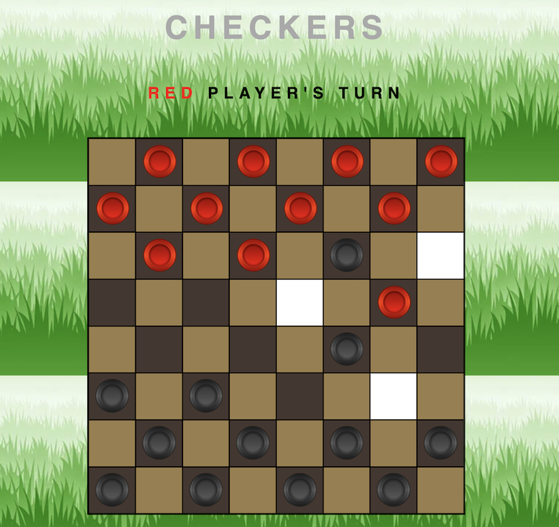
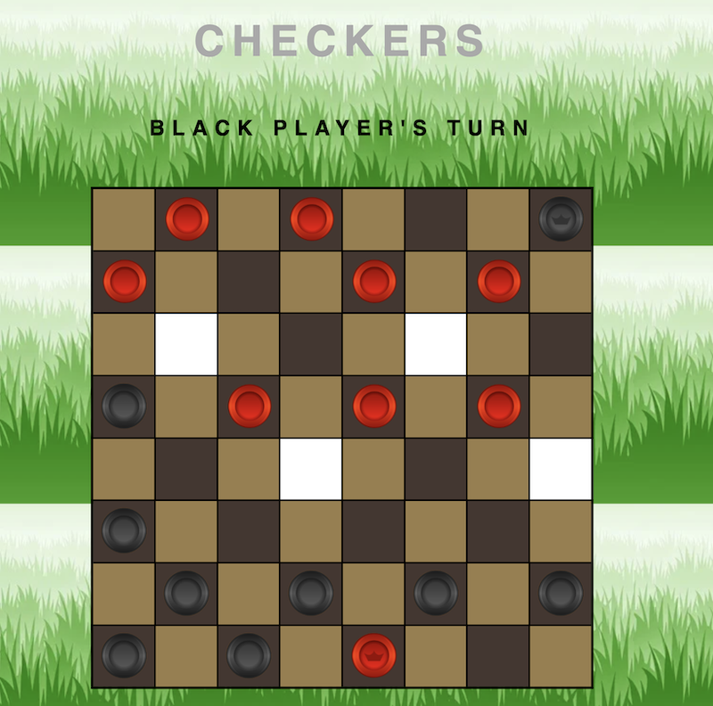
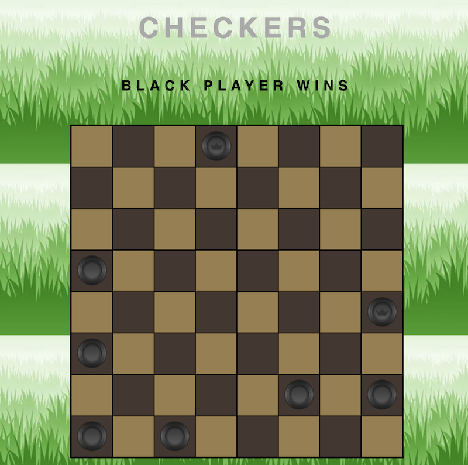
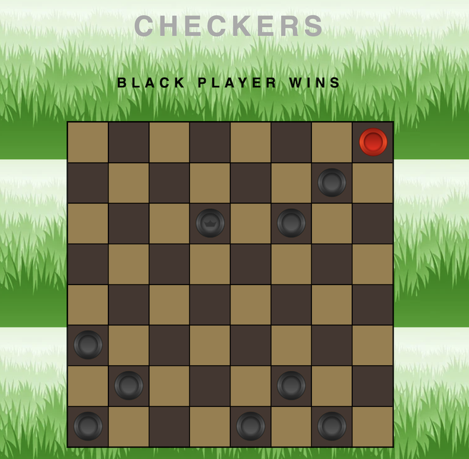

# A Classic Game Of Checkers!

 

  A turn-based game where pieces move in a diagonal direction
  Jump over the enemy pieces and be the last player on the board!
   
  <a href="https://sylvestersmithiii.github.io/Checkers-Game/">Play the Game!</a>

# Screenshots

# Technology Used

* HTML
* CSS
* JavaScript

# Get Started

<a href="https://sylvestersmithiii.github.io/Checkers-Game/">Play the Game!</a>

**Board Setup:** The game is played on an 8x8 square board. Each player starts with 12 pieces, represented by colored discs, placed on the dark squares of their side of the board.

**Movement:** Regular pieces, often called "men," can only move diagonally forward. Kings, which are promoted men, can move both forward and backward diagonally. A piece can move one square diagonally to an adjacent empty square.

**Capturing:** If an opponent's piece is adjacent to one of your pieces, and there is an empty square immediately beyond it, you can jump over the opponent's piece and capture it. Multiple jumps can be made in a single turn if they are available. After a capture, the capturing piece may continue jumping and capturing additional opponent pieces if possible.

**Promotion:** When a man reaches the opposite end of the board (the last row on the opponent's side), it is promoted to a king. Kings have increased mobility and can move both forward and backward.

**Objective:** The goal is to either capture all of your opponent's pieces or block them in such a way that they cannot make any more legal moves. If a player cannot move or has no more pieces remaining, they lose the game.

# Next Step

* Implement a computer to play against
* Options to change piece and board color
* Add custom sounds for the clicks
* Add animation for pieces jumping
